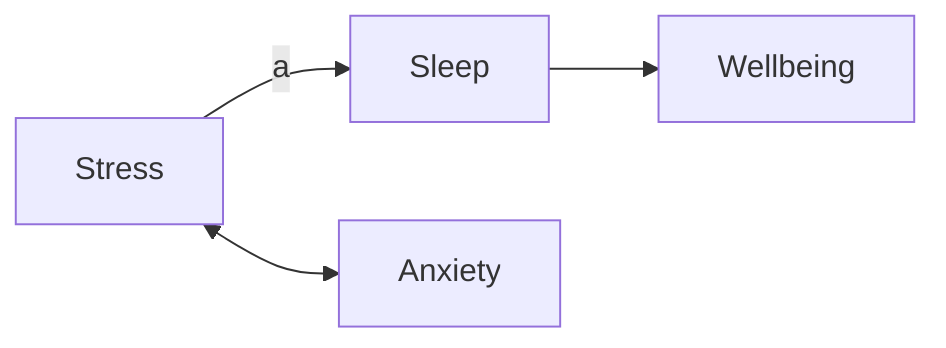

# SEM Syntax Import

pathJ imports pasted SEM/path syntax through a safe parser. Imported text is never evaluated as R code. The parser builds an AST, converts it to the internal graph schema, validates supported features, then exports lavaan syntax for the current estimator and Mermaid/Mplus/OpenMx text for round-trip editing.

## Supported Inputs

| Feature | Mplus-style | OpenMx RAM | lavaan | Mermaid | Internal schema |
| --- | --- | --- | --- | --- | --- |
| Directed paths | `y ON x;` | `mxPath(from="x", to="y", arrows=1)` | `y ~ x` | `x --> y` | `edge(type="regression")` |
| Latent loadings | `f BY y1 y2;` | `latentVars` plus `mxPath(from="f", to="y1")` | `f =~ y1 + y2` | directed edge | `edge(type="loading")` |
| Covariances | `x WITH z;` | `arrows=2` | `x ~~ z` | `x <--> z` | `edge(type="covariance")` |
| Parameter labels | `y ON a*x;` | `labels="a"` | `y ~ a*x` | edge labels | edge metadata |
| Fixed values | `y1@1` in growth/loadings | `free=FALSE, values=1` | `1*y1` | not native | edge metadata |
| Categorical variables | `CATEGORICAL ARE y;` | manifest metadata only | ordered variables via options | not native | metadata |
| Groups | `GROUPING IS g (...)` | separate model metadata | jamovi multigroup option | not native | group nodes/metadata |
| Multilevel blocks | `%WITHIN%`, `%BETWEEN%` | RAM metadata only | `level: 1`, `level: 2` | not native | level metadata |
| Constraints/defined effects | `MODEL CONSTRAINT` assignments | labels preserved | `:=`, `==`, `<`, `>` | not native | metadata |

## Examples

Mplus-style:

```text
VARIABLE:
  CATEGORICAL ARE depression;
  GROUPING IS gender (1=women 2=men);
MODEL:
  wellbeing BY wb1 wb2 wb3;
  depression ON stress anxiety;
  stress WITH anxiety;
MODEL CONSTRAINT:
  indirect = a*b;
```

OpenMx RAM:

```r
mxModel("example",
  manifestVars=c("stress","anxiety","depression","wb1","wb2","wb3"),
  latentVars=c("wellbeing"))
mxPath(from="stress", to="depression", arrows=1, labels="a")
mxPath(from="wellbeing", to=c("wb1","wb2","wb3"), arrows=1)
mxPath(from="stress", to="anxiety", arrows=2)
```

Mermaid:



## Conversion Limits

The importer preserves unsupported features as warnings where possible. Estimation still runs through the engines currently available in pathJ, with lavaan as the direct model backend. OpenMx, brms, and Stan mappings are reported as exportable or candidate mappings; pathJ does not execute OpenMx, brms, or Stan code from pasted syntax.

Mplus commands that configure files, analysis settings, estimators, savedata, montecarlo, or arbitrary transformations are not executed. OpenMx calls are parsed as text; custom R expressions inside arguments are ignored unless they are simple strings, numbers, booleans, or `c(...)` vectors.

## Internal Graph Schema

Imported models normalize to:

- `nodes`: observed, latent, residual, intercept, and group nodes.
- `edges`: directed regressions, loadings, covariances, variances, labels, fixed/free state, values, line numbers, groups, and levels.
- `metadata`: categorical variables, grouping declarations, constraints, indirect effects, mediation paths, and engine support warnings.

This schema is the editable bridge between pasted syntax, the graphical model builder, Mermaid diagrams, and generated lavaan/Mplus/OpenMx exports.
